Quicklogs application will keep and track of income-expense of a user on a day to day basis. Each user will be required to register to use the application. This application contains a calculator that takes income (annually), maximum daily expense, and the amount of saving a user plans to reach annually as inputs and calculates the amount of saving. If the user exceeds the daily expense limit, the amount of saving is reduced by the amount of extra expense. If the saving becomes 0 then it gives you a new daily expense amount to maintain the saving goals, and if the daily expense is less than the amount of planned expense, then it will add the surplus to the saving. The expense tracking application will generate a report at the end of a month to show savings, expense via multiple graphs.

 

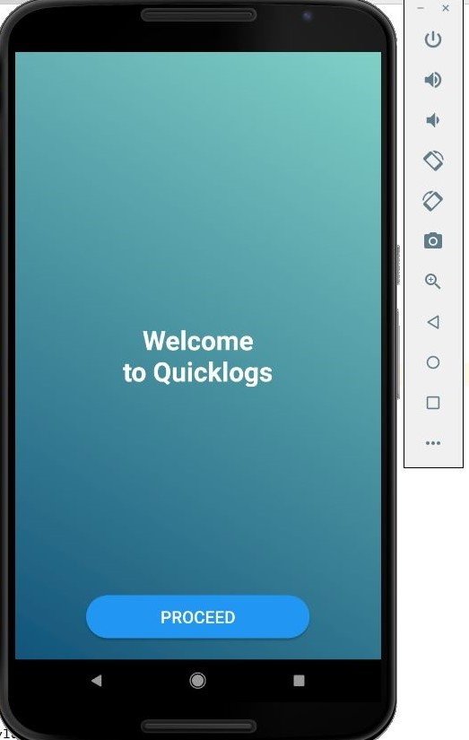 

  
  

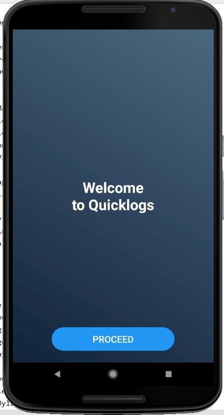 

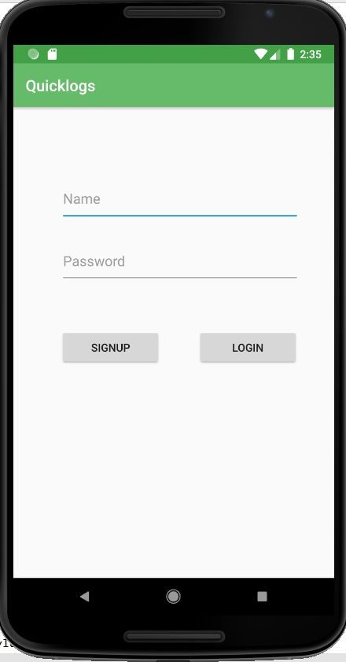 

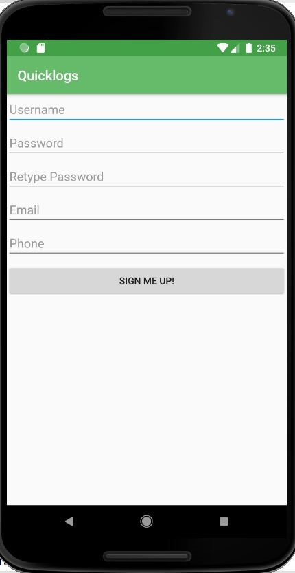 

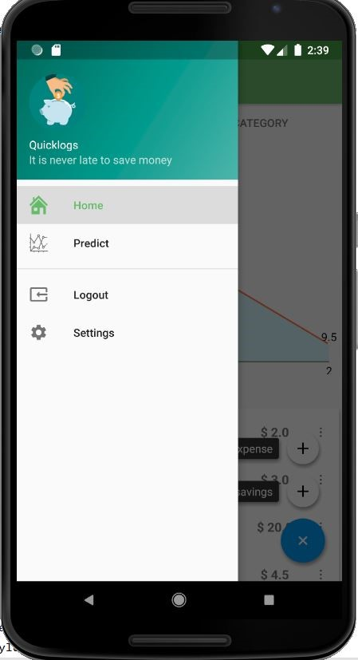 

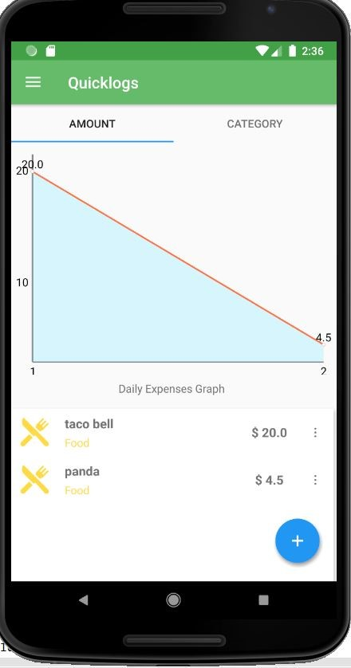 

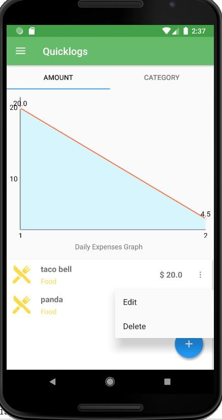 

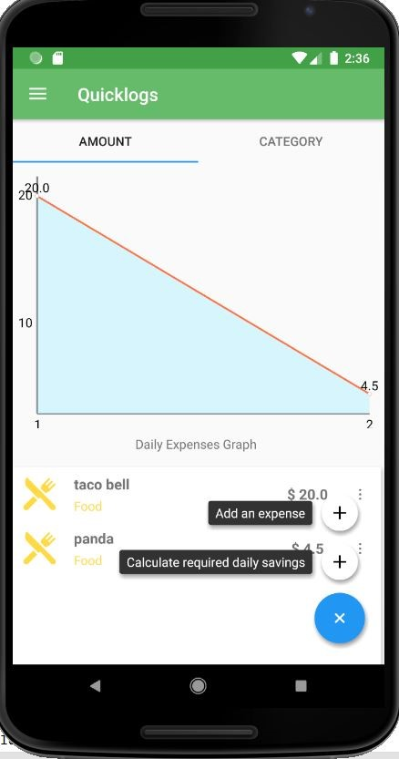 

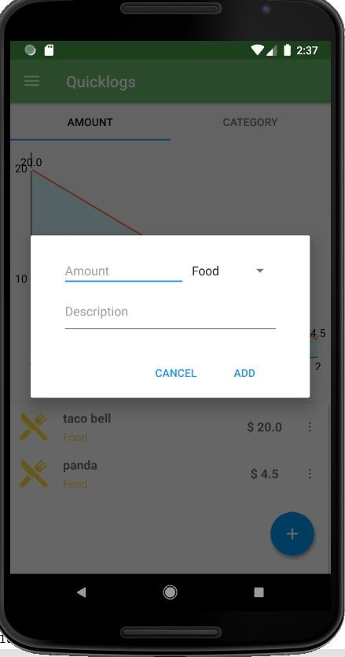 

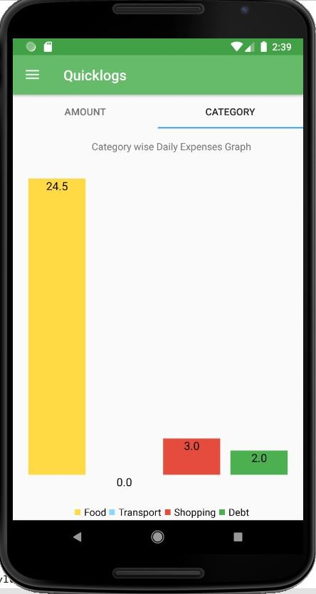 

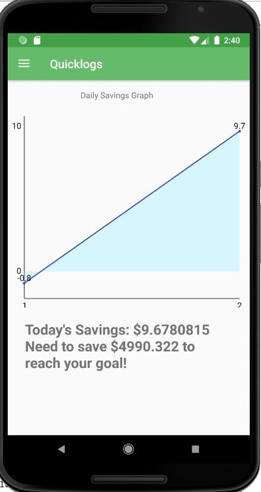 

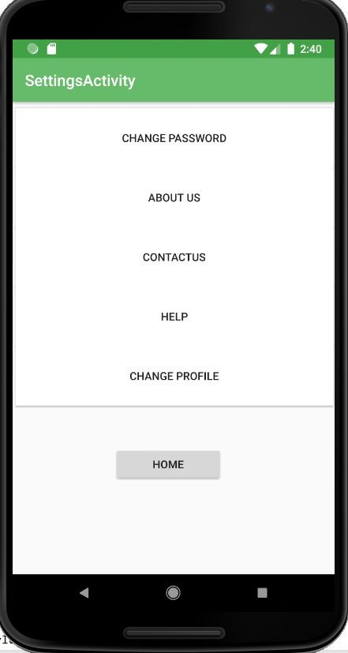 

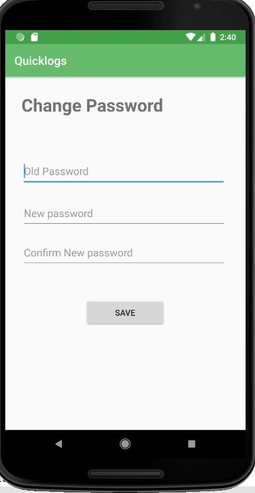 

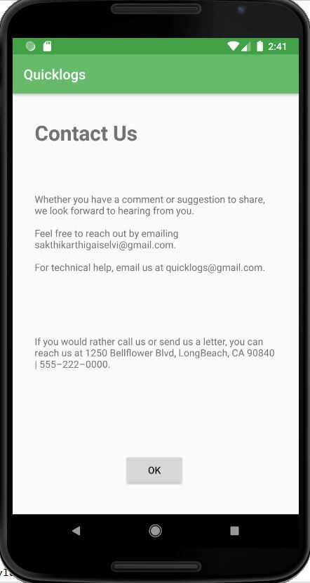 

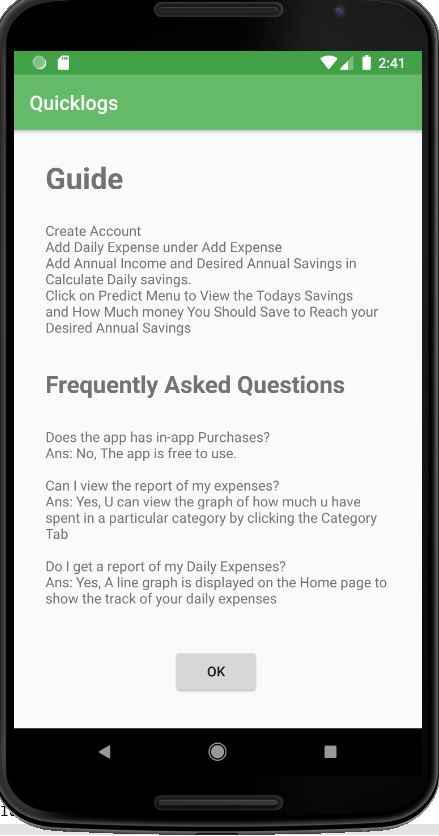 

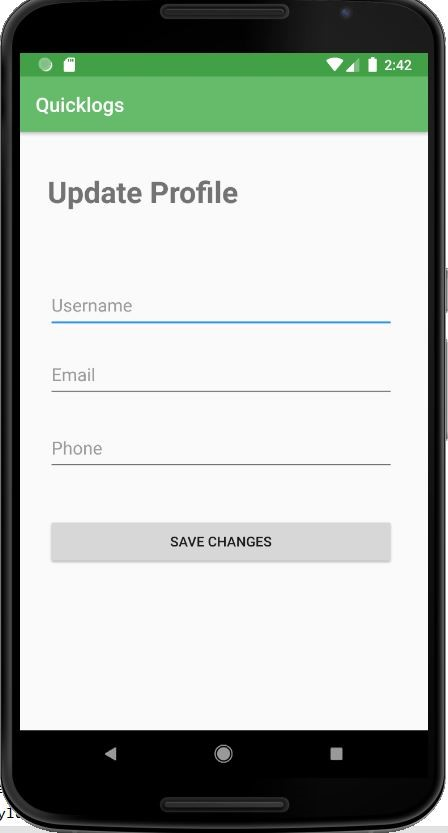 
